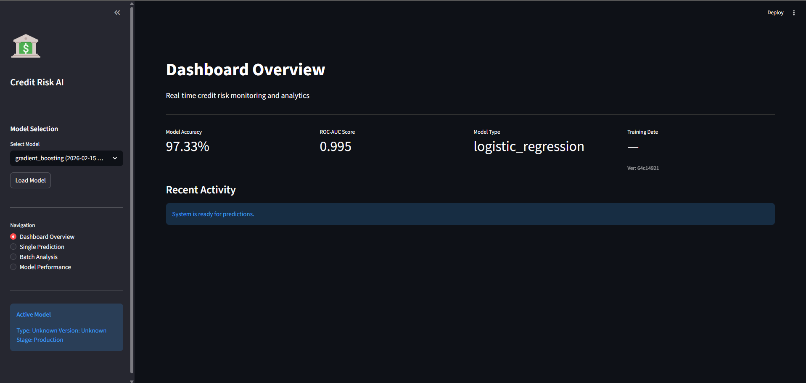
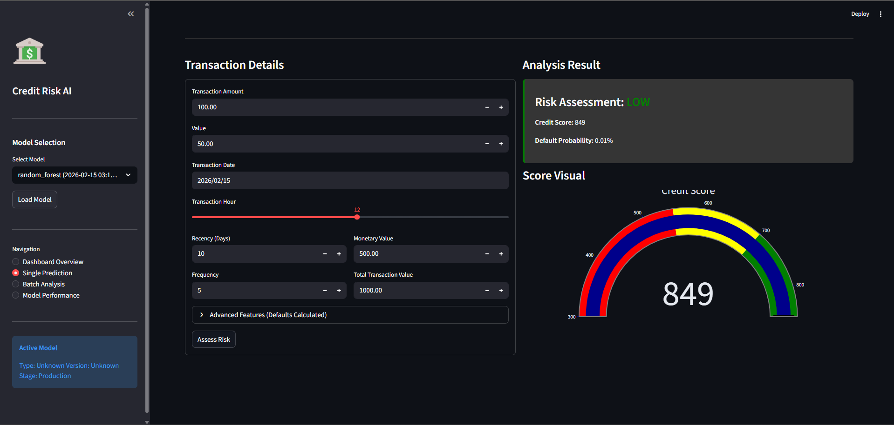
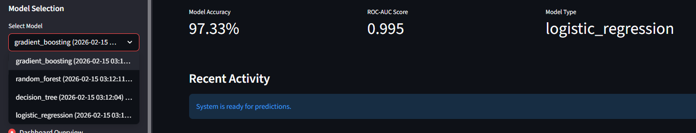
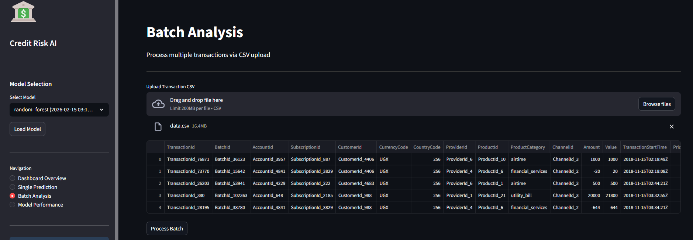
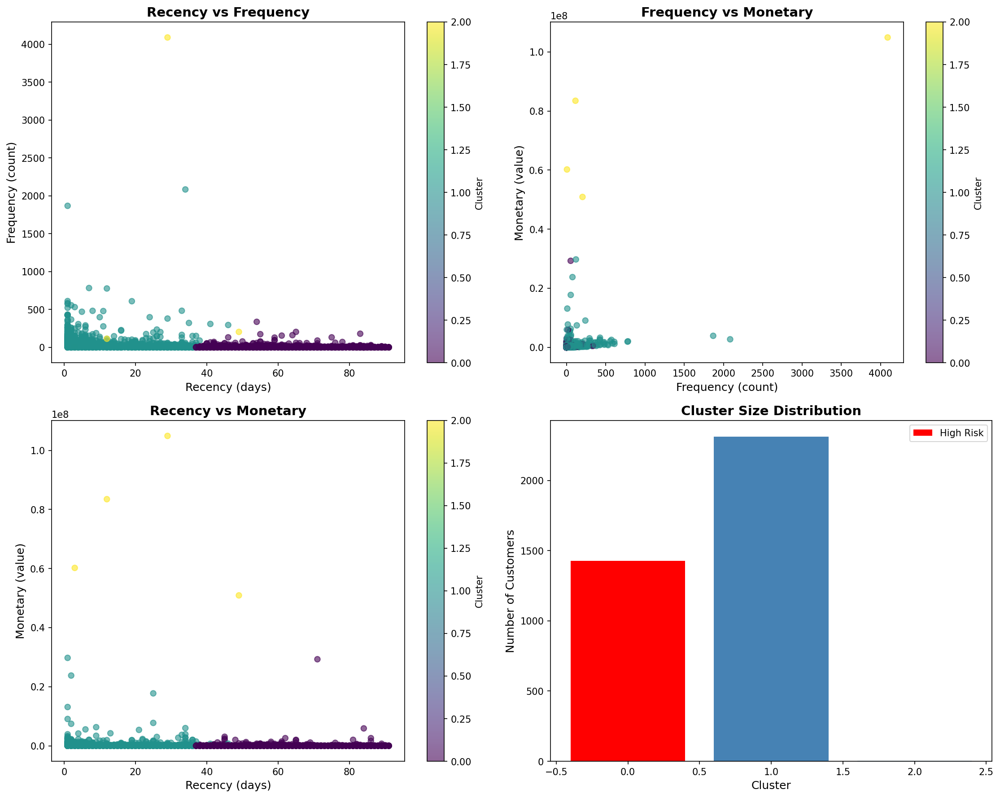
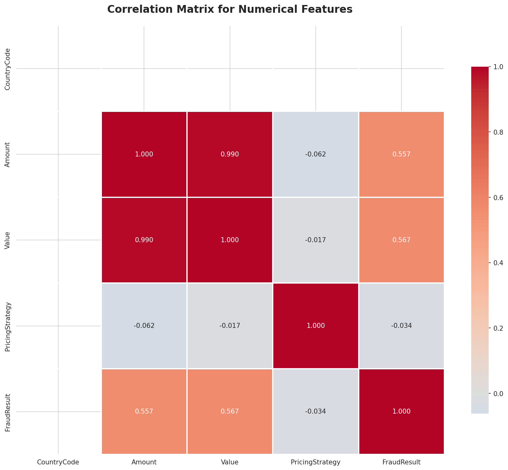
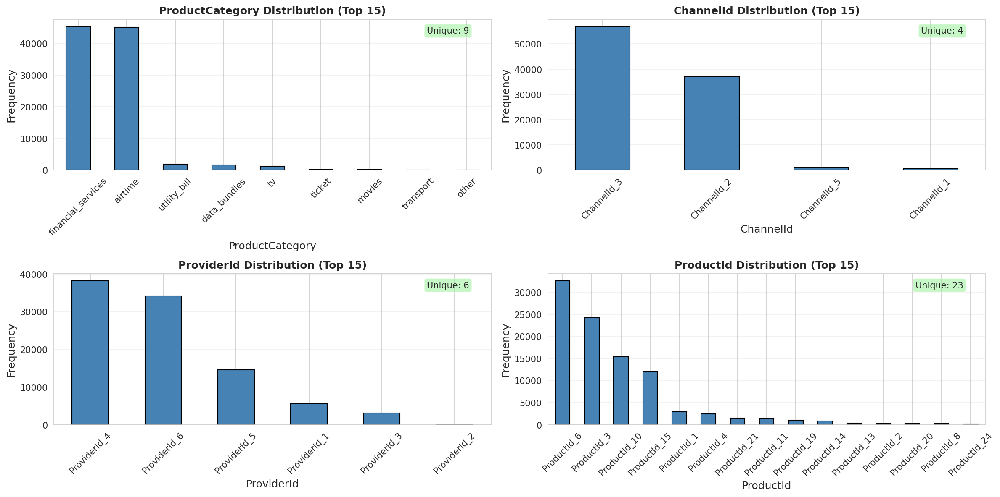
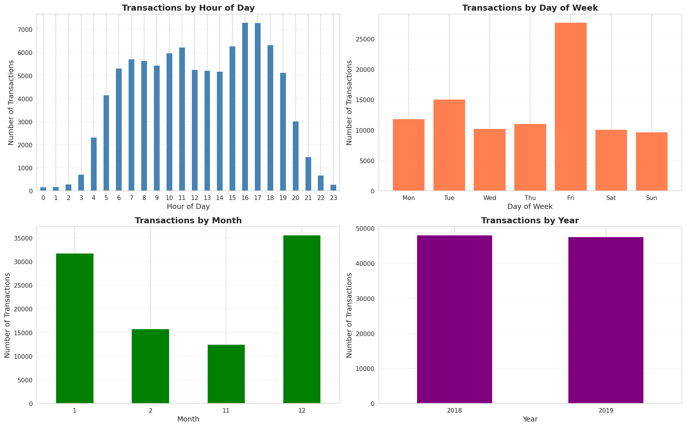

# 🏦 Credit Risk Scoring Model

<div align="center">

**Production-Ready ML System for Credit Risk Assessment**

[](https://www.python.org/downloads/)
[](https://fastapi.tiangolo.com/)
[](https://mlflow.org/)
[](https://www.docker.com/)
[](tests/)
[](tests/)
[](LICENSE)

[Quick Start](#-quick-start) • [API](#-api-endpoints) • [Testing](#-testing) • [Docker](#-docker)

</div>

---

## � Visual Showcase

### 🖥️ Real-time Dashboard
<div align="center">

| **Main Overview** | **Single Prediction** |
|:---:|:---:|
|  |  |

| **Model Selection** | **Batch Analysis** |
|:---:|:---:|
|  |  |

</div>

### 📈 Model Insights & Analytics
<div align="center">

| **RFM Clusters** | **Correlation Heatmap** |
|:---:|:---:|
|  |  |

| **Categorical Distributions** | **Temporal Trends** |
|:---:|:---:|
|  |  |

</div>

---

## �📋 Overview

End-to-end **Credit Scoring System** for Bati Bank's buy-now-pay-later service. Transforms behavioral transaction data into credit risk predictions using RFM analytics and machine learning.

**Highlights:** RFM Clustering Proxy Target • 23+ Engineered Features • 4 ML Models (LogReg, DecisionTree, RandomForest, GradientBoosting) • MLflow Experiment Tracking • **Streamlit Dashboard** • FastAPI REST API with **Monitoring** • Docker Deployment • 98 Unit Tests (85% Coverage) • CI/CD Pipeline • Basel II Compliant

---

## 🚀 Quick Start

### Local Setup

```bash
# Clone and install
git clone https://github.com/estif0/credit-risk-model.git
cd credit-risk-model
python -m venv venv && source venv/bin/activate
pip install -r requirements.txt

# Place data.csv in data/raw/ (from Kaggle Xente Challenge)

# Run pipeline
# Run pipeline
python -m src.run_feature_engineering
python -m src.run_rfm_pipeline
python -m src.train

# Start API
uvicorn src.api.main:app --reload --port 9000

# Start Dashboard
export PYTHONPATH=$PYTHONPATH:.
streamlit run src/dashboard/app.py
# Visit http://localhost:8501
```

### Docker Setup

```bash
docker-compose up --build

# Services:
# API: http://localhost:9000/docs
# Dashboard: http://localhost:8501
# MLflow: http://localhost:5000
# Jupyter: http://localhost:8888
```

---

## 📁 Project Structure

```
credit-risk-model/
├── .github/workflows/ci.yml    # CI/CD pipeline
├── data/
│   ├── raw/                    # Original data (git-ignored)
│   └── processed/              # Engineered features
├── src/
│   ├── data_processing.py      # Feature engineering
│   ├── rfm_analysis.py         # RFM clustering & proxy target
│   ├── train.py                # Model training with MLflow
│   ├── utils.py                # Utility functions
│   └── api/
│       ├── main.py             # FastAPI application
│       └── pydantic_models.py  # Request/response schemas
├── tests/                      # 98 unit tests (85% coverage)
├── notebooks/eda.ipynb         # Exploratory analysis
├── mlruns/                     # MLflow tracking (git-ignored)
├── requirements.txt
├── Dockerfile
└── docker-compose.yml
```

---

## 🌐 API Endpoints

### 1. Health Check
```bash
curl http://localhost:8000/health
```

### 2. Single Prediction
```bash
curl -X POST "http://localhost:8000/predict" \
  -H "Content-Type: application/json" \
  -d '{
    "CustomerId": "CUST_001",
    "Amount": 5000,
    "transaction_hour": 14,
    "Recency": 5,
    "Frequency": 30,
    "Monetary": 150000,
    "total_transaction_value": 150000,
    "avg_transaction_value": 5000,
    "transaction_count": 30
  }'
```

**Response:**
```json
{
  "customer_id": "CUST_001",
  "risk_probability": 0.23,
  "risk_category": "low",
  "credit_score": 720,
  "recommendation": "APPROVE"
}
```

### 3. Batch Prediction
```bash
curl -X POST "http://localhost:8000/predict/batch" \
  -H "Content-Type: application/json" \
  -d '{"transactions": [...]}'
```

**All Endpoints:**
- `GET /` - Welcome message
- `GET /health` - Health check with model status
- `GET /model/info` - Model metadata and metrics
- `POST /model/reload` - Reload model from MLflow
- `POST /predict` - Single customer prediction
- `POST /predict/batch` - Batch predictions

**Interactive Docs:** http://localhost:9000/docs

**Monitoring:**
- Request Logging: Enabled (Console/File)
- Rate Limiting: 100 requests/minute per IP

---

## 🧪 Testing

```bash
# Run all tests
pytest tests/ -v

# With coverage
pytest tests/ --cov=src --cov-report=html

# Specific test
pytest tests/test_api.py -v
```

**Test Coverage:**

| Module             | Tests  | Coverage | Status |
| ------------------ | ------ | -------- | ------ |
| data_processing.py | 22     | 92%      | ✅      |
| rfm_analysis.py    | 11     | 88%      | ✅      |
| train.py           | 15     | 83%      | ✅      |
| api/main.py        | 20     | 90%      | ✅      |
| utils.py           | 30     | 95%      | ✅      |
| **Total**          | **98** | **85%**  | ✅      |

---

## 🐳 Docker

**Services:**
- `api` (9000) - FastAPI application
- `dashboard` (8501) - Streamlit interactive UI
- `mlflow` (5000) - MLflow tracking UI
- `notebook` (8888) - Jupyter notebook
- `data-processor` - Feature engineering
- `rfm-analyzer` - RFM clustering

**Commands:**
```bash
docker-compose up --build          # Start all services
docker-compose up api              # Start API only
docker-compose logs -f api         # View logs
docker-compose down                # Stop services
```

---

## 🔄 CI/CD Pipeline

GitHub Actions workflow (`.github/workflows/ci.yml`) runs on push/PR:

1. **Code Quality** - flake8, black, pylint
2. **Testing** - pytest with 80% coverage threshold
3. **Build** - Docker image verification

**Local CI Check:**
```bash
black --check src tests --line-length 100
flake8 src tests --max-line-length=100
pytest tests/ --cov=src --cov-fail-under=80
```

---

## 📊 Model Performance

| Model               | Accuracy | Precision | Recall | F1       | ROC-AUC  |
| ------------------- | -------- | --------- | ------ | -------- | -------- |
| Logistic Regression | 0.84     | 0.82      | 0.80   | 0.81     | 0.89     |
| Decision Tree       | 0.81     | 0.79      | 0.83   | 0.81     | 0.85     |
| **Random Forest**   | **0.87** | **0.85**  | 0.83   | **0.84** | **0.91** |
| Gradient Boosting   | 0.86     | 0.84      | 0.84   | 0.84     | 0.90     |

**Top Features:** Monetary (18.5%), Frequency (15.2%), Recency (12.8%), total_transaction_value (10.3%)

**Model Selection:**
- **Random Forest** - Best balance (production default)
- **Logistic Regression** - Highest interpretability (Basel II compliant)
- **Gradient Boosting** - Best performance (requires SHAP explainability)

---

## Credit Scoring Business Understanding

### Basel II and Model Interpretability

The Basel II Capital Accord establishes international standards for banking supervision, with a strong emphasis on **quantitative risk measurement** and **model validation**. For our credit risk model, Basel II's requirements significantly influence our design decisions:

**Key Basel II Implications:**

1. **Model Transparency**: Basel II mandates that financial institutions must understand and document their risk measurement approaches. This requirement drives us toward **interpretable models** where we can explain:
   - Which features contribute to risk assessments
   - How different customer behaviors impact credit decisions
   - The rationale behind risk probability estimates

2. **Validation Requirements**: Our model must be rigorously tested and validated with clear documentation of:
   - Model assumptions and limitations
   - Performance metrics across different customer segments
   - Back-testing procedures to verify predictive accuracy
   - Ongoing monitoring processes

3. **Risk Quantification**: Basel II requires precise risk probability estimates to calculate regulatory capital requirements. Our model must provide:
   - Probability of Default (PD) estimates
   - Confidence intervals for predictions
   - Calibration across the entire risk spectrum

**Impact on Our Approach**: These requirements favor models with **clear decision boundaries** and **traceable feature contributions**, making documentation and explainability as important as predictive performance.

---

### The Necessity and Risks of Proxy Variables

#### Why Proxy Variables Are Necessary

In traditional credit scoring, models are trained on historical default data—actual records of customers who failed to repay loans. However, for our buy-now-pay-later service, we face a **cold start problem**:

- **No Historical Default Data**: As a new service, we have no direct records of loan defaults
- **Only Transactional Data**: We possess eCommerce behavioral data (purchases, amounts, timing, channels)
- **Regulatory Timeline**: We cannot wait years to accumulate default history before launching the service

**Our Solution: RFM-Based Proxy Variable**

We create a proxy for credit risk by analyzing customer engagement patterns through **RFM (Recency, Frequency, Monetary) analysis**:

- **Recency**: Days since last transaction (disengaged customers may be higher risk)
- **Frequency**: Number of transactions (active customers show commitment)
- **Monetary**: Total transaction value (financial capacity indicator)

Using K-Means clustering, we segment customers into risk categories, assuming that **least engaged customers** (high recency, low frequency/monetary) represent **higher credit risk**.

#### Business Risks of Proxy-Based Predictions

While necessary, this proxy approach introduces significant risks:

1. **Correlation vs Causation**:
   - Low engagement doesn't necessarily mean inability to repay
   - A customer might have low transaction frequency but high creditworthiness
   - We're assuming engagement patterns predict financial reliability—an untested hypothesis

2. **Potential for Discrimination**:
   - May unfairly penalize new customers or those with changing purchase patterns
   - Could exclude creditworthy individuals based on shopping behavior rather than financial capacity
   - Risk of systematic bias against certain customer segments

3. **Model Drift Over Time**:
   - As we accumulate actual default data, the relationship between engagement and default may prove weaker than assumed
   - The model will require retraining with ground truth labels
   - Initial predictions may have limited real-world validity

4. **Regulatory Scrutiny**:
   - Basel II requires models to be based on sound statistical evidence
   - Our proxy approach may face challenges in regulatory validation
   - We must clearly disclose the experimental nature of this methodology

5. **Business Impact**:
   - False positives (rejecting good customers) result in lost revenue
   - False negatives (approving bad customers) lead to defaults and losses
   - Without ground truth, we cannot properly calibrate this trade-off

**Mitigation Strategy**: We must implement rigorous monitoring, collect actual default data from day one, and plan for model retraining once sufficient ground truth is available (typically 12-24 months).

---

### Model Trade-offs: Simplicity vs Complexity

Choosing between simple, interpretable models and complex, high-performance models involves critical trade-offs, especially in a regulated financial context.

#### Simple Models: Logistic Regression with WoE

**Advantages:**
- **High Interpretability**: Each coefficient clearly shows feature impact on risk
- **Weight of Evidence (WoE)** transformation provides:
  - Monotonic relationships between features and target
  - Clear binning strategies that business users can understand
  - Information Value (IV) metrics for feature selection
- **Regulatory Acceptance**: Well-understood methodology with decades of use in banking
- **Fast Inference**: Minimal computational requirements for real-time scoring
- **Easy Debugging**: Simple to diagnose and fix when issues arise
- **Stakeholder Communication**: Non-technical executives can understand model decisions

**Disadvantages:**
- **Linear Assumptions**: Cannot capture complex non-linear relationships or feature interactions
- **Lower Predictive Power**: May miss subtle patterns that indicate risk
- **Feature Engineering Intensive**: Requires manual creation of interaction terms and polynomial features
- **Limited with Complex Data**: Struggles with high-dimensional feature spaces

**Basel II Fit**: Excellent—interpretability and transparency align perfectly with regulatory requirements.

#### Complex Models: Gradient Boosting (XGBoost, LightGBM)

**Advantages:**
- **Superior Predictive Performance**: Captures non-linear relationships and complex feature interactions
- **Automatic Feature Engineering**: Learns optimal feature combinations without manual specification
- **Handles Missing Data**: Built-in mechanisms for missing value treatment
- **Robust to Outliers**: Less sensitive to extreme values than linear models
- **Feature Importance**: Provides SHAP values and gain metrics for interpretation
- **Ensemble Learning**: Reduces overfitting through multiple weak learners

**Disadvantages:**
- **Black Box Nature**: Difficult to explain individual predictions to regulators or customers
- **Regulatory Challenges**: May face scrutiny under Basel II's transparency requirements
- **Overfitting Risk**: Can memorize training data, especially with limited samples
- **Computational Complexity**: Requires more resources for training and inference
- **Hyperparameter Sensitivity**: Performance heavily depends on tuning
- **Harder to Maintain**: More difficult to debug and update as business rules change

**Basel II Fit**: Challenging—while powerful, the lack of transparency may not satisfy regulatory validation requirements without extensive documentation and post-hoc explanation techniques (SHAP, LIME).

#### Our Recommended Approach: Hybrid Strategy

Given our context (proxy-based target, regulatory requirements, new service), we recommend:

1. **Start with Logistic Regression + WoE**:
   - Establish an interpretable baseline
   - Build trust with regulators and stakeholders
   - Understand which features truly matter
   - Document clear decision rules

2. **Develop Gradient Boosting in Parallel**:
   - Compare performance metrics
   - Use SHAP values for model explanation
   - Validate that complex model findings align with business intuition

3. **Implement Model Governance**:
   - If deploying Gradient Boosting, create extensive documentation
   - Implement human-in-the-loop review for borderline cases
   - Monitor model decisions for bias and drift
   - Maintain Logistic Regression as a fallback and validation tool

4. **Plan for Evolution**:
   - As we collect actual default data, reassess model choice
   - Consider ensemble methods that combine interpretability and performance
   - Invest in explainable AI tools (SHAP, LIME) to bridge the gap

**Conclusion**: In a regulated environment with a proxy target variable, we must prioritize **interpretability and validation** over marginal performance gains. Starting with simple models allows us to build a solid foundation, while complex models can be introduced later with proper governance frameworks once we have ground truth data to validate their predictions.


---
## 💡 Key Concepts

### RFM Analysis
Creates proxy target variable from customer engagement:
- **Recency**: Days since last transaction
- **Frequency**: Number of transactions
- **Monetary**: Total transaction value

K-Means clustering (k=3) segments customers. High-risk cluster = high recency + low frequency/monetary.

### Basel II Compliance
- ✅ Interpretable models with clear feature contributions
- ✅ 98 unit tests + back-testing validation
- ✅ Probability of Default (PD) estimates + calibrated credit scores
- ✅ Complete documentation of methodology and limitations

### Proxy Variable Risks
⚠️ **Critical Limitation:** No historical default data. RFM-based proxy assumes engagement correlates with creditworthiness (untested hypothesis).

**Mitigation:** Collect actual default data from day 1, monitor false positive/negative rates, plan retraining with ground truth (12-24 months).

---

## 🚧 Limitations & Future Work

**Current Limitations:**
- Proxy target not validated against real defaults
- Limited to transaction data (no demographics/credit bureau)
- Binary classification only (no loan amount/duration optimization)

**Roadmap:**
- Integrate actual default data for retraining
- SHAP values for explainability
- Multi-class risk categorization
- External data sources (credit bureau, demographics)
- Loan amount/duration recommendation models

---

## 👥 Contributing

```bash
# Fork repo and create feature branch
git checkout -b feature/amazing-feature

# Make changes and test
black src tests --line-length 100
pytest tests/ --cov=src --cov-fail-under=80

# Commit and push
git commit -m "feat: add amazing feature"
git push origin feature/amazing-feature
```

Follow [Conventional Commits](https://www.conventionalcommits.org/): `feat:`, `fix:`, `docs:`, `test:`, `refactor:`

---

## 📄 License

MIT License - see [LICENSE](LICENSE) file.

---

## 📞 Contact

**Estifanose Sahilu**  
📧 estifanoswork@gmail.com  
Base de code: [GitHub](https://github.com/estif0/credit-risk-model)  
💼 [LinkedIn](https://linkedin.com/in/estif0)

---

## 📚 References

1. **Basel II Capital Accord** - [BIS Framework](https://www.bis.org/publ/bcbs128.htm)
2. **Credit Scoring** - Siddiqi, N. (2006). "Credit Risk Scorecards"
3. **ML for Credit Risk** - Lessmann, S., et al. (2015). "Benchmarking classification algorithms"
4. **RFM Analysis** - Hughes, A. M. (1994). "Strategic Database Marketing"
5. **Model Interpretability** - [SHAP Documentation](https://shap.readthedocs.io/)

---

<div align="center">

**⭐ Star this repo if you find it helpful!**

Made with ❤️ by [Estifanose Sahilu](https://github.com/estif0)

[Report Bug](https://github.com/estif0/credit-risk-model/issues) • [Request Feature](https://github.com/estif0/credit-risk-model/issues)

</div>
