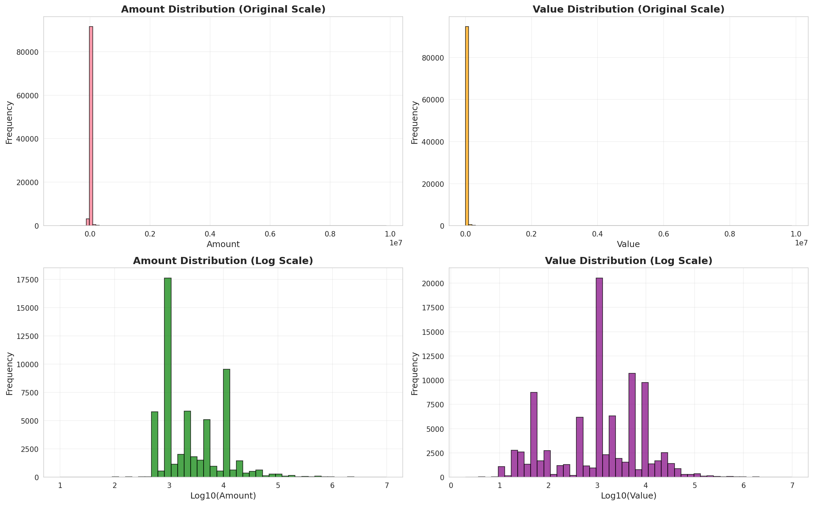
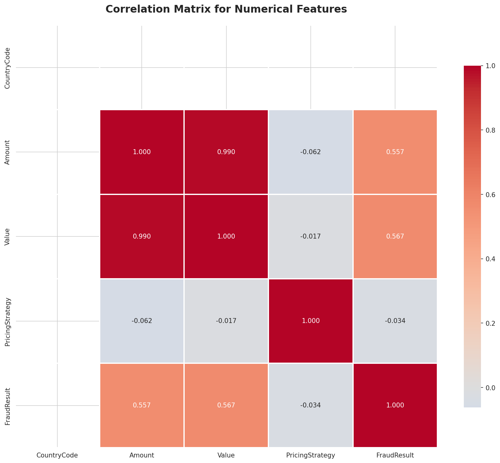
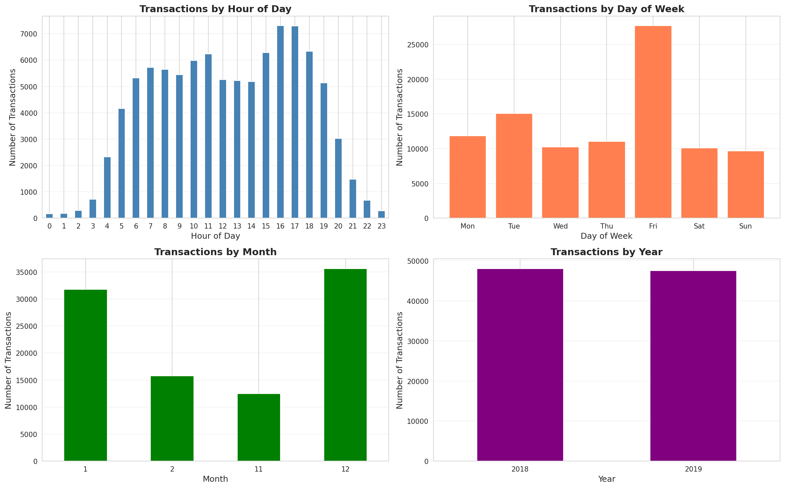
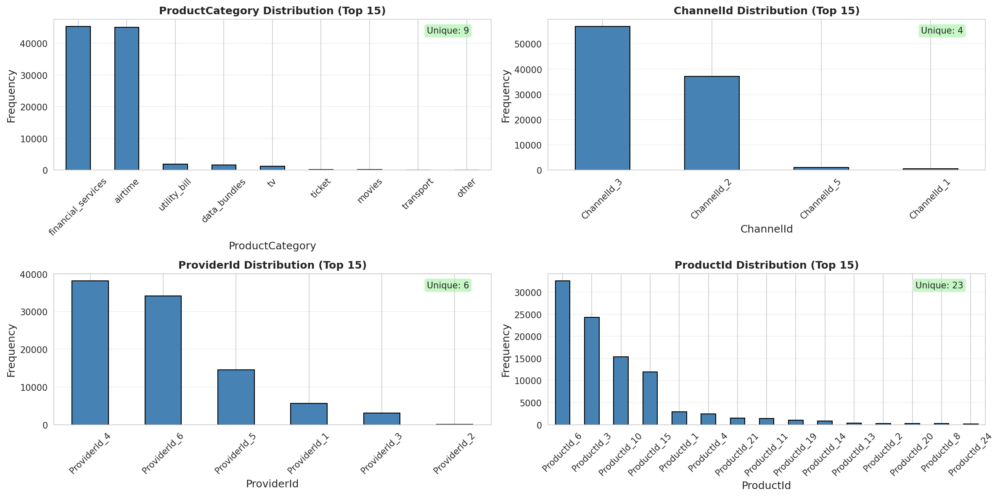

# Interim Report: Credit Risk Probability Model
## Bati Bank Buy-Now-Pay-Later Service

**Author:** Estifanose Sahilu | **Date:** December 14, 2025 | **Status:** Tasks 1-2 Complete

---

## Executive Summary

I have completed business understanding and EDA on 95,662 Xente Challenge transactions for Bati Bank's buy-now-pay-later credit scoring model. Key findings: zero missing values, extreme skewness (51+) requiring transformation, and clear RFM segmentation opportunities. The dataset is suitable for proxy-based credit risk modeling despite the cold-start problem.

---

## 1. Business Objective and Strategic Context

**Challenge:** Bati Bank's new buy-now-pay-later service faces a **cold-start problem**—no historical default data exists. I must build a credit scoring model using only eCommerce transactional data to enable responsible lending decisions.

**Basel II Compliance:** The Basel II Accord's emphasis on quantitative risk measurement requires: (1) model transparency with explainable features, (2) rigorous validation and monitoring, and (3) precise Probability of Default estimates. This favors **interpretable models** (Logistic Regression with WoE) as baseline, with complex models (Gradient Boosting) requiring extensive SHAP/LIME explanations.

**Proxy Variable Approach:**

I use **RFM (Recency, Frequency, Monetary) analysis** to create a proxy target. Hypothesis: customers with high recency, low frequency, and low monetary value represent higher credit risk due to low engagement.

**Business Risks:** (1) Unvalidated assumption—engagement may not correlate with creditworthiness, (2) potential discrimination against infrequent purchasers, (3) model drift requiring retraining in 12-24 months, (4) regulatory scrutiny of proxy approach. **Mitigation:** Rigorous monitoring, collect actual default data, human review for borderline cases.

**Model Strategy:** Start with **Logistic Regression + WoE** (interpretable, Basel II-compliant) as baseline, develop **Gradient Boosting** with SHAP explanations in parallel for comparison. Prioritize interpretability over marginal performance gains in this regulated, proxy-target environment.

---

## 2. Exploratory Data Analysis

**Dataset:** 95,662 transactions × 16 features | 90-day period (Nov 2018 - Feb 2019) | Zero missing values

**Summary Statistics:**

| Feature      | Median | Mean        | Skewness | Strategy              |
| ------------ | ------ | ----------- | -------- | --------------------- |
| Amount/Value | 1,000  | 6,718-9,901 | 51+      | Log transformation    |
| Outliers     | —      | 15%         | —        | Transform, not remove |

*Figure 1: Extreme right-skewness (51+) requires log transformation for linear models.*

**Correlation:** Amount-Value correlation = 0.990 (multicollinearity). Solution: Use Value only, create binary `is_credit` feature.

*Figure 2: Near-perfect Amount-Value correlation necessitates feature reduction.*

**Temporal Patterns:** Peak hours 4-5 PM, Friday 2× other days, Nov-Dec holiday spikes. 90% transactions occur 6 AM-11 PM.

*Figure 3: Clear temporal signals for behavior profiling and fraud detection.*

**Categorical Features:** Low cardinality (ProductCategory: 6, ChannelId: 5) → one-hot encoding. High cardinality (ProviderId: 144, ProductId: 97) → target encoding/WoE.

*Figure 4: 15% outliers in Amount/Value preserved for predictive value.*

**Top 5 Insights:**

1. **Perfect Data Quality:** Zero missing values enables immediate feature engineering without imputation
2. **Extreme Skewness:** Skewness 51+ requires log transformation; diverse segments (small frequent vs. large infrequent buyers)
3. **Multicollinearity:** Amount-Value 0.990 correlation demands dropping one feature
4. **Encoding Strategy:** High cardinality (ProviderId: 144, ProductId: 97) requires target/WoE encoding
5. **RFM Suitability:** 90-day period with CustomerId, timestamps, and values ideal for proxy target creation

*Figure 5: Cardinality analysis guides encoding strategy selection.*

---

## 3. Next Steps and Roadmap for Remaining Tasks

### 3.1 Task 3: Feature Engineering (In Progress)

**Objective:** Transform raw transaction data into predictive features for modeling.

**My Approach:**

**Aggregate Features (Per Customer):**
- Transaction count: Number of transactions per CustomerId
- Total transaction value: Sum of Value per customer
- Average transaction value: Mean of Value per customer
- Transaction value standard deviation: Volatility indicator
- Transaction value range: Max - Min per customer

**Temporal Feature Extraction:**
- Hour of day (0-23): Peak activity indicators
- Day of week (0-6): Weekday vs weekend behavior
- Month (1-12): Seasonal patterns
- Days since first transaction: Customer tenure
- Days between t

**Task 3 - Feature Engineering:**
- Aggregate per customer: transaction count, total/avg/std/range of value
- Temporal: hour, day, month, tenure, transaction frequency
- Encoding: one-hot (low cardinality), target/WoE (high cardinality)
- Scaling: StandardScaler, log transformation, `is_credit` binary
- Implementation: sklearn.pipeline.Pipeline for reproducibility

**Task 4 - RFM Proxy Target:**
- Calculate Recency (days since last), Frequency (count), Monetary (sum)
- K-Means clustering (k=3) on scaled RFM
- Identify high-risk cluster (high R, low F, low M)
- Assign binary `is_high_risk` target, merge to transaction level

**Task 5 - Model Training:**
- Models: Logistic Regression + WoE, Decision Tree, Random Forest, XGBoost
- Tuning: GridSearchCV with 5-fold stratified CV
- MLflow: Track params, metrics (accuracy, precision, recall, F1, ROC-AUC), models
- Selection: Prioritize interpretability, then performance and stability

**Task 6 - Deployment:**
- FastAPI: `/predict` endpoint returning risk_probability, risk_category, credit_score
- Docker: Multi-stage build with MLflow integration
- CI/CD: GitHub Actions for linting (flake8, black), testing (pytest 80% coverage), building, deploying

### 3.2 Summary and Timeline
completed the foundational phases: business understanding aligned with Basel II requirements and comprehensive EDA revealing exceptional data quality (zero missing values), critical challenges (skewness 51+, multicollinearity), and clear RFM segmentation opportunities. My immediate focus: feature engineering and RFM analysis to deliver a deployable, interpretable credit scoring model by December 16 deadline.

**Timeline:** Feature Engineering (Dec 14) → RFM Analysis (Dec 14-15) → Model Training (Dec 15-16) → Deployment (Dec 16)

---

**Author:** Estifanose Sahilu | **Submitted:** December 14, 2025